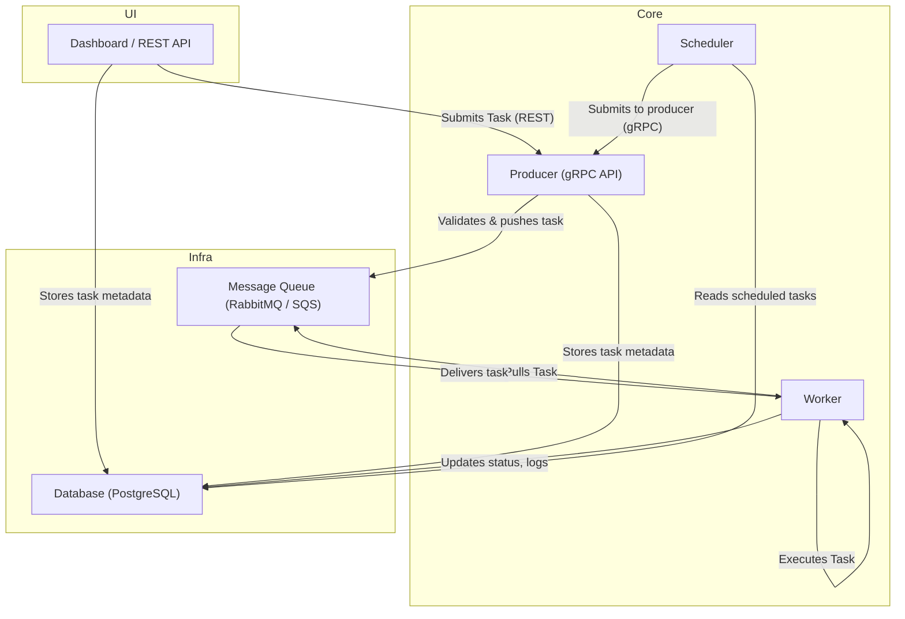

# GoTaskQ

**GoTaskQ** is a distributed task queue system built in Go, designed for high performance, reliability, and full visibility into asynchronous workloads. It aims to provide a clean, extensible architecture that supports multiple queue backends, a simple function registration mechanism, and powerful monitoring tools.

This project is currently in development.

## What is GoTaskQ?

GoTaskQ is a general-purpose task execution framework that allows you to offload, schedule, and monitor background jobs using a queue-based system. It supports submitting tasks via REST, gRPC, and a built-in dashboard, and is designed to integrate easily with modern backend services.

At its core, GoTaskQ connects a message queue to a user-defined task registry and provides full lifecycle management of task execution — including retries, timeouts, cancellation, and detailed status tracking.

## Goals

- **Queue Backend Agnostic**: Support RabbitMQ, AWS SQS, and Redis Streams with a clean abstraction layer.
- **Multi-Protocol Submission**: Tasks can be submitted via REST, gRPC, or directly through the dashboard.
- **Function Registry**: Define and register task functions by name, and let the system dispatch messages to the correct handler.
- **Visibility**: Real-time dashboard for monitoring queues, workers, logs, errors, execution metadata, and more.
- **Reliability**: Built-in retry mechanism, dead-letter queue (DLQ) support, and task status persistence.
- **Security**: API keys for REST/gRPC, and authentication for dashboard access.
- **Control**: User-defined max concurrency, task timeouts, and cancellation support.

## Planned Features

### Task Submission

- Submit tasks via REST, gRPC, or the dashboard
- Support for batch submission
- Each task includes:
  - A `function_key` that maps to a registered Go function
  - Arbitrary JSON payload
  - Optional task-level settings like timeout, retries, and priority

### Task Execution

- Register custom functions in Go at startup
- Dispatcher routes tasks based on the `function_key`
- Task-level timeout and cancellation support
- Configurable worker pool size
- Retries with backoff strategy
- Dead Letter Queue for permanently failed tasks

### Queue Backends

- RabbitMQ
- AWS SQS
- Redis Streams

### Status Tracking & Metadata

- Persistent task status:
  - `PENDING`, `STARTED`, `SUCCESS`, `FAILURE`, `CANCELED`
- Stores:
  - Execution time
  - Retry count
  - Timestamps (created, started, completed)
  - Result or error messages
- Pluggable storage backends (Redis, SQL)

### Dashboard

- Web-based UI for:
  - Submitting new tasks
  - Viewing live task status
  - Filtering and searching tasks
  - Viewing execution logs and errors
  - Requeuing or canceling tasks
- Authenticated access for operators

### APIs and Access Control

- REST and gRPC APIs for task submission and status querying
- API key authentication
- Logging for all task lifecycle events

## Status

GoTaskQ is under active development and not yet ready for production use. This repository is currently a staging ground for architectural decisions and implementation work.

If you’re interested in this project or want to collaborate, feel free to open an issue or reach out.

Absolutely. Below is:

1. ✅ A **fixed Mermaid diagram** reflecting the full architecture with all interactions.
2. ✅ A professional, GitHub-friendly **Architecture section** you can directly use in your README.

---

## Architecture

This system is a modular, self-hosted distributed task queue platform built in Go, designed for high-performance internal use.

### Components

- **Dashboard / REST API**
  A UI and API layer to submit tasks, track job status, view logs, retry/cancel jobs, and configure the system.

- **Producer**
  Exposes a gRPC interface for submitting tasks. Validates incoming payloads using task-specific logic and pushes them to the configured message queue (RabbitMQ/SQS). Stores all task metadata into the database.

- **Message Queue**
  RabbitMQ, AWS SQS, or other pluggable queue systems. Delivers tasks to workers in a load-balanced, at-most-once manner.

- **Worker(s)**
  Workers pull tasks from the queue, execute the corresponding registered task function, and update execution status, logs, metadata, etc., back to the database.

- **Scheduler**
  A lightweight background service that checks for scheduled (delayed) tasks in the database. When the scheduled time arrives, it submits them through the Producer, reusing the same validation and queueing pipeline.

- **Database**
  Central state store for job metadata, task status, logs, retry counts, execution time, and scheduling info.

## License

MIT
