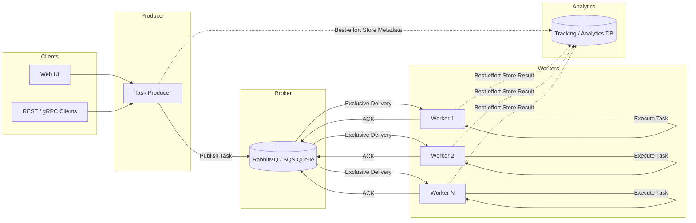

# GoTaskQ

**GoTaskQ** is a distributed task queue system built in Go, designed for high performance, reliability, and full visibility into asynchronous workloads. It aims to provide a clean, extensible architecture that supports multiple queue backends, a simple function registration mechanism, and powerful monitoring tools.

This project is currently in development.

## What is GoTaskQ?

GoTaskQ is a general-purpose task execution framework that allows you to offload, schedule, and monitor background jobs using a queue-based system. It supports submitting tasks via REST, gRPC, and a built-in dashboard, and is designed to integrate easily with modern backend services.

At its core, GoTaskQ connects a message queue to a user-defined task registry and provides full lifecycle management of task execution — including retries, timeouts, cancellation, and detailed status tracking.

## Goals

- **Queue Backend Agnostic**: Support RabbitMQ, AWS SQS, and Redis Streams with a clean abstraction layer.
- **Multi-Protocol Submission**: Tasks can be submitted via REST, gRPC, or directly through the dashboard.
- **Function Registry**: Define and register task functions by name, and let the system dispatch messages to the correct handler.
- **Visibility**: Real-time dashboard for monitoring queues, workers, logs, errors, execution metadata, and more.
- **Reliability**: Built-in retry mechanism, dead-letter queue (DLQ) support, and task status persistence.
- **Security**: API keys for REST/gRPC, and authentication for dashboard access.
- **Control**: User-defined max concurrency, task timeouts, and cancellation support.

## Planned Features

### Task Submission

- Submit tasks via REST, gRPC, or the dashboard
- Support for batch submission
- Each task includes:
  - A `function_key` that maps to a registered Go function
  - Arbitrary JSON payload
  - Optional task-level settings like timeout, retries, and priority

### Task Execution

- Register custom functions in Go at startup
- Dispatcher routes tasks based on the `function_key`
- Task-level timeout and cancellation support
- Configurable worker pool size
- Retries with backoff strategy
- Dead Letter Queue for permanently failed tasks

### Queue Backends

- RabbitMQ
- AWS SQS
- Redis Streams

### Status Tracking & Metadata

- Persistent task status:
  - `PENDING`, `STARTED`, `SUCCESS`, `FAILURE`, `CANCELED`
- Stores:
  - Execution time
  - Retry count
  - Timestamps (created, started, completed)
  - Result or error messages
- Pluggable storage backends (Redis, SQL)

### Dashboard

- Web-based UI for:
  - Submitting new tasks
  - Viewing live task status
  - Filtering and searching tasks
  - Viewing execution logs and errors
  - Requeuing or canceling tasks
- Authenticated access for operators

### APIs and Access Control

- REST and gRPC APIs for task submission and status querying
- API key authentication
- Logging for all task lifecycle events

## Architecture

This system is a modular, self-hosted distributed task queue platform built in Go, designed for high-performance internal use.

### Components

#### Dashboard / API Layer

  Provides a Web UI and REST/gRPC APIs for submitting tasks and viewing task-related information such as submission history, execution status, and logs.

  This layer acts purely as an entry point and observability interface. It does **not** participate in task execution and does not make any execution decisions.

#### Producer

  The Producer receives task submission requests from the API layer and is responsible for:

  * Validating incoming task payloads and metadata
  * Assigning a unique task identifier
  * Publishing the task message to the configured message broker (RabbitMQ or SQS)

  The Producer may **best-effort persist task metadata** to the database for tracking and analytics.
  The database is **not** a source of truth, and failures to persist metadata do not affect task execution.

#### Message Queue (Broker)**

  A pluggable message broker such as RabbitMQ or AWS SQS that serves as the **authoritative source of truth** for task delivery.

  Responsibilities include:

  * Durable storage of task messages
  * Exclusive delivery of each task to exactly one worker at a time
  * Preventing concurrent execution of the same task
  * Redelivery of tasks if a worker crashes or fails to acknowledge

  Tasks are removed from the queue **only after successful acknowledgment** by a worker.
  The system provides **at-least-once delivery semantics**.

#### Worker(s)

  Workers are long-running processes that continuously poll the message queue for tasks.

  Each worker:

  * Receives tasks exclusively from the broker
  * Executes the corresponding registered task function
  * Best-effort persists execution metadata (status, logs, timing, errors) to the database
  * Acknowledges the task after successful execution

  Workers are stateless, do not coordinate with each other, and **never read from the database** to determine execution behavior.

#### Database (Tracking / Analytics)

  A persistence layer used solely for **observability and analytics**, including:

  * Task submission metadata
  * Execution status and timestamps
  * Logs and error details

  The database is **non-authoritative** and **eventually consistent**.
  Missing or inconsistent records do not impact correctness or execution of tasks.

## Status

GoTaskQ is under active development and not yet ready for production use. This repository is currently a staging ground for architectural decisions and implementation work.

If you’re interested in this project or want to collaborate, feel free to open an issue or reach out.

## License

MIT
